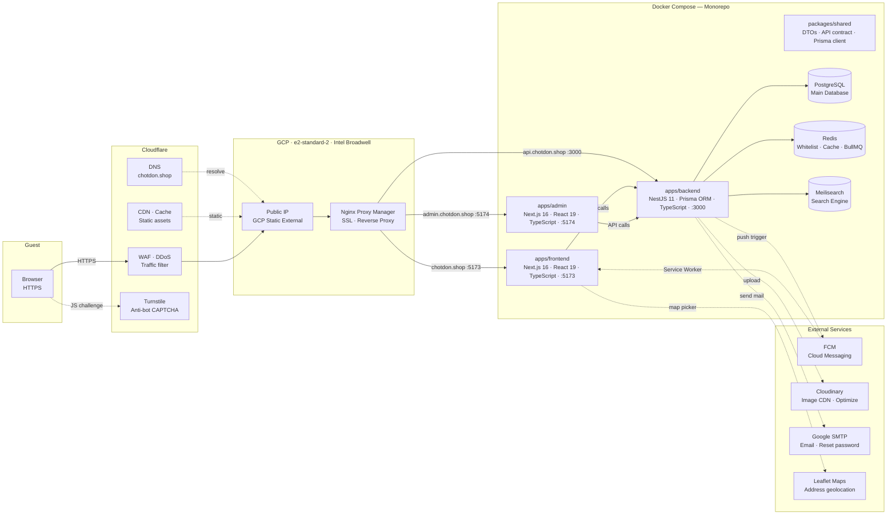

# E-Commerce Monorepo Project

Dự án e-commerce xây dựng theo mô hình monorepo chia sẻ contract dữ liệu chặt chẽ giữa frontend và backend thông qua package shared. Dự án tập trung vào luồng mua hàng tối ưu, hiệu năng cao, tích hợp các giải pháp bảo mật và chuẩn tiếp cận quốc tế.

# Kiến trúc hạ tầng — chotdon.shop

## Sơ đồ tổng quan



---

## Chi tiết các thành phần hạ tầng

### Cloudflare

| Thành phần            | Vai trò                                                                                    |
| --------------------- | ------------------------------------------------------------------------------------------ |
| **DNS**               | DNS Resolver quản lý bản ghi tên miền `chotdon.shop`.                                      |
| **WAF · DDoS Shield** | Lọc lưu lượng truy cập độc hại, chống các cuộc tấn công DDoS ở tầng ứng dụng.              |
| **CDN · Cache**       | Lưu trữ đệm các tài nguyên tĩnh (images, JS, CSS) gần biên giúp giảm tải máy chủ gốc.      |
| **Turnstile**         | Giải pháp xác thực chống bot/spam không xâm nhập tích hợp trực tiếp vào biểu mẫu Frontend. |

### GCP VM (e2-standard-2)

| Thành phần              | Vai trò / Thông số kỹ thuật                                                                    |
| ----------------------- | ---------------------------------------------------------------------------------------------- |
| **Public IP**           | IP ngoại vi tĩnh của GCP — cổng truy cập duy nhất vào hạ tầng.                                 |
| **Nginx Proxy Manager** | Đóng vai trò là Reverse Proxy, tự động cấp và gia hạn SSL Let's Encrypt, điều phối subdomains. |
| **Cấu hình phần cứng**  | Machine type: `e2-standard-2` (2 vCPUs, 8 GB Memory, kiến trúc Intel Broadwell).               |

Định tuyến Subdomain:

- `chotdon.shop` → Frontend Container (`:5173`)
- `admin.chotdon.shop` → Admin Dashboard Container (`:5174`)
- `api.chotdon.shop` → Backend NestJS Container (`:3000`)

### Docker Compose — Monorepo Services

| Thành phần          | Công nghệ / Stack                   | Vai trò                                                                                    |
| ------------------- | ----------------------------------- | ------------------------------------------------------------------------------------------ |
| **packages/shared** | DTOs, API Contract, Prisma Client   | Module chia sẻ mã nguồn dùng chung giữa Client và Server để đảm bảo tính toàn vẹn dữ liệu. |
| **apps/frontend**   | Next.js 16 · React 19 · TypeScript  | Ứng dụng client-side cho người dùng cuối.                                                  |
| **apps/admin**      | Next.js 16 · React 19 · TypeScript  | Bảng điều khiển quản trị cho nhân viên và admin hệ thống.                                  |
| **apps/backend**    | NestJS 11 · Prisma ORM · TypeScript | Hệ thống API trung tâm xử lý logic nghiệp vụ.                                              |
| **PostgreSQL**      | PostgreSQL 16                       | Hệ quản trị cơ sở dữ liệu quan hệ chính của toàn bộ hệ thống.                              |
| **Redis**           | Redis Stack                         | Bộ nhớ đệm (Caching), lưu whitelist token xác thực và hàng đợi BullMQ.                     |
| **Meilisearch**     | Meilisearch Engine                  | Công cụ tìm kiếm toàn văn (Full-text Search) tốc độ cao cho sản phẩm.                      |

### Dịch vụ tích hợp bên ngoài (External Services)

| Dịch vụ          | Tích hợp                                           | Luồng dữ liệu                                |
| ---------------- | -------------------------------------------------- | -------------------------------------------- |
| **Firebase FCM** | SDK gửi thông báo đẩy thời gian thực.              | Backend -> FCM Service -> Web Service Worker |
| **Cloudinary**   | Quản lý lưu trữ và tối ưu hóa hình ảnh tải lên.    | Backend -> Cloudinary API                    |
| **Google SMTP**  | Gửi email kích hoạt tài khoản, khôi phục mật khẩu. | Backend -> SMTP Server                       |
| **Leaflet Maps** | Bản đồ tương tác định vị vị trí giao hàng.         | Frontend -> OpenStreetMap API                |

---

## Luồng Request & Điều phối dữ liệu

```
Client Browser
 └─► Cloudflare (DNS → WAF/DDoS → CDN)
       └─► GCP Public IP
             └─► Nginx Proxy Manager (SSL terminate)
                   ├─► chotdon.shop       → Next.js Frontend (:5173)
                   │     ├─► Leaflet Maps
                   │     └─► FCM Service Worker (Push alert)
                   ├─► admin.chotdon.shop → Next.js Admin Dashboard (:5174)
                   └─► api.chotdon.shop   → NestJS Backend (:3000)
                         ├─► PostgreSQL (Main DB qua Prisma client)
                         ├─► Redis Server
                         │     ├─► Token Whitelist (Bảo mật JWT sessions)
                         │     ├─► Category Cache (Tối ưu hóa sơ đồ danh mục cây)
                         │     └─► BullMQ Queue (Hàng đợi đặt hàng bất đồng bộ)
                         ├─► Meilisearch Engine (Đồng bộ & Truy vấn tìm kiếm nhanh)
                         ├─► FCM Admin SDK (Kích hoạt thông báo)
                         ├─► Cloudinary SDK (Upload hình ảnh)
                         └─► Google SMTP Server (Mail transaction)
```

---

## Danh sách công nghệ sử dụng (Technology Stack)

| Hạng mục                   | Công nghệ sử dụng                                                           |
| -------------------------- | --------------------------------------------------------------------------- |
| **Domain & DNS**           | `chotdon.shop` quản trị qua Cloudflare.                                     |
| **CDN & Bảo mật biên**     | Cloudflare Edge Caching + WAF + Turnstile CAPTCHA.                          |
| **Hạ tầng máy chủ**        | GCP e2-standard-2 (2 vCPUs, 8 GB Memory, Intel Broadwell).                  |
| **Proxy & Routing**        | Nginx Proxy Manager (SSL Auto Let's Encrypt).                               |
| **Kiến trúc Frontend**     | Next.js 16 (App Router), React 19, TypeScript, Tailwind CSS, Framer Motion. |
| **Kiến trúc Backend**      | NestJS 11, Prisma ORM, TypeScript.                                          |
| **Cơ sở dữ liệu chính**    | PostgreSQL 16.                                                              |
| **Bộ nhớ đệm (Cache)**     | Redis (Lưu whitelist token xác thực và cấu trúc cây danh mục Category).     |
| **Hàng đợi thông điệp**    | Redis BullMQ (Xử lý hàng đợi đặt đơn hàng bất đồng bộ chịu tải cao).        |
| **Công cụ tìm kiếm**       | Meilisearch (Đồng bộ hóa dữ liệu từ Postgres phục vụ tìm kiếm toàn văn).    |
| **Thông báo đẩy**          | Firebase Cloud Messaging (FCM).                                             |
| **Quản lý đa phương tiện** | Cloudinary Image API.                                                       |
| **Dịch vụ Email**          | Nodemailer tích hợp Google SMTP.                                            |
| **Bản đồ địa lý**          | Leaflet.js & OpenStreetMap.                                                 |

---

## Luồng nghiệp vụ & Giải pháp kỹ thuật nâng cao

### 1. Xác thực bảo mật với Token Whitelist (Redis)

- Hệ thống sử dụng cặp **Access Token** (ngắn hạn) và **Refresh Token** (dài hạn) lưu trữ trong HTTP-Only Cookie chống tấn công XSS.
- Để hỗ trợ vô hiệu hóa tài khoản tức thì hoặc đăng xuất từ xa, ID của các Refresh Token hợp lệ được duy trì trong một danh sách trắng (**Token Whitelist**) trên Redis. Khi thực hiện xác thực, Backend kiểm tra sự tồn tại của token trên Redis giúp giảm thiểu số lượng truy vấn trực tiếp vào PostgreSQL.

### 2. Tối ưu hóa truy cập Danh mục (Category Caching)

- Danh mục sản phẩm được thiết kế theo mô hình phân cấp dạng cây (Category Tree). Việc truy vấn đệ quy cây danh mục từ PostgreSQL thường tốn nhiều tài nguyên xử lý.
- Hệ thống lưu trữ cấu trúc cây danh mục hoàn chỉnh đã được định dạng JSON trực tiếp trên Redis. Mỗi khi có thay đổi từ trang quản trị (Admin CRUD), bộ nhớ đệm này sẽ tự động bị xóa (Cache Invalidation) để tải lại dữ liệu mới nhất.

### 3. Xử lý đặt đơn hàng bất đồng bộ chịu tải cao (Redis BullMQ Queue)

- Khi xảy ra sự kiện Flash Sale hoặc lượng truy cập mua hàng tăng đột biến, việc ghi trực tiếp đơn hàng vào Database cùng lúc có thể gây nghẽn kết nối và khóa bảng (DB Lock).
- Luồng đặt hàng được chuyển đổi sang bất đồng bộ:
  1. Khi người dùng bấm đặt hàng, thông tin đơn hàng được đẩy vào hàng đợi **BullMQ** lưu trên Redis dưới dạng Job.
  2. Hệ thống phản hồi ngay lập tức cho client trạng thái "Đang xử lý đơn hàng".
  3. Một Worker chạy ngầm ở Backend sẽ lấy từng Job từ hàng đợi ra, kiểm tra ràng buộc kho bằng khóa phân tán (Distributed Lock) và thực hiện nghiệp vụ ghi đơn vào PostgreSQL qua Prisma Transactions một cách tuần tự và an toàn.

### 4. Tìm kiếm sản phẩm tốc độ cao (Meilisearch)

- Thay vì sử dụng truy vấn `LIKE` chậm chạp trong cơ sở dữ liệu quan hệ, dữ liệu sản phẩm được đồng bộ tự động sang **Meilisearch**.
- Người dùng thực hiện tìm kiếm toàn văn (Full-text Search), tìm kiếm theo từ khóa gần đúng (Fuzzy Search), phân trang và lọc thuộc tính sản phẩm với phản hồi cực nhanh (dưới 10ms).

---

## Danh sách tính năng và Trạng thái hoàn thành (Feature Checklist)

### 1. Xác thực & Người dùng (Authentication & User Profile)

- [x] Đăng ký tài khoản (Sign Up) & Đăng nhập (Sign In) bằng Email/Password (mật khẩu băm PBKDF2).
- [x] Cấp phát & quản lý JWT (Access/Refresh Token) trên NestJS backend.
- [x] Quản lý **Token Whitelist trên Redis** hỗ trợ thu hồi token và đăng xuất tức thì.
- [x] Tự động gia hạn phiên đăng nhập (Refresh Token queue) tại request client.
- [x] Đăng xuất (Logout) xóa cookie và thu hồi token trên Redis.
- [x] Luồng quên mật khẩu (Forgot Password) & Đặt lại mật khẩu (Reset Password) qua Google SMTP.
- [x] Cập nhật thông tin cá nhân (Profile Update) & Thay đổi mật khẩu (Change Password).
- [x] Tải lên và cập nhật ảnh đại diện (Avatar Cloudinary Upload).
- [x] Sổ địa chỉ (Address book CRUD): Thêm, sửa, xóa nhiều địa chỉ giao hàng.
- [x] Định vị địa điểm địa chỉ qua bản đồ tương tác (Map Picker Modal/Leaflet).

### 2. Trang chủ & Khám phá (Homepage & Discovery)

- [x] Hiển thị các section động (Dynamic sections/banners) theo cấu hình ngôn ngữ.
- [x] Trang sản phẩm mới (New Arrivals) hỗ trợ cuộn vô hạn (Infinite Scrolling) và virtual grid layout.
- [x] Trang thương hiệu (Brands listing) hiển thị danh sách các thương hiệu nổi bật.
- [x] Tính năng Tìm kiếm toàn cầu hiệu năng cao tích hợp qua **Meilisearch**.

### 3. Danh mục & Thương hiệu (Categories & Brands)

- [x] Hiển thị cây danh mục sản phẩm (Category Tree) đa cấp.
- [x] Tối ưu hóa hiệu năng tải cây danh mục thông qua **Redis Category Caching**.
- [x] Xem sản phẩm theo thương hiệu (Brand details) & Danh sách thương hiệu hàng đầu (Top Brands).
- [x] Lọc sản phẩm theo danh mục và thương hiệu tương ứng.

### 4. Sản phẩm & Chi tiết (Products & Catalog)

- [x] Danh sách sản phẩm hỗ trợ bộ lọc nâng cao (Danh mục, Thương hiệu, Rating, Khoảng giá).
- [x] Sắp xếp sản phẩm (Sorting) theo giá tăng/giảm, hàng mới nhất.
- [x] Trang chi tiết sản phẩm hiển thị thông số, thuộc tính và chọn biến thể SKU.
- [x] Tự động tối ưu fallback SKU khi hết hàng hoặc thông tin SKU không hợp lệ.
- [x] Gửi đánh giá sản phẩm (Ratings & Reviews): Điểm số (1-5 sao), bình luận.
- [x] Lọc đánh giá theo ratings, phân trang đánh giá tại Client.
- [x] Kiểm tra điều kiện đánh giá (chỉ người mua sản phẩm đã nhận hàng thành công mới được đánh giá).

### 5. Yêu thích & Sản phẩm đã xem (Favorites & Browsing History)

- [x] Thêm/Xóa sản phẩm khỏi danh sách yêu thích (Wishlist).
- [x] Đồng bộ yêu thích thời gian thực, hiển thị trạng thái yêu thích trên thẻ sản phẩm.
- [x] Tự động ghi nhận lịch sử duyệt sản phẩm (Recently Viewed).
- [x] Xem danh sách các sản phẩm đã xem gần đây.

### 6. Flash Sale & Khuyến mãi (Flash Sales & Coupons)

- [x] Hiển thị danh sách Flash Sale đang diễn ra kèm đồng hồ countdown thời gian thực.
- [x] Áp dụng tồn kho Flash Sale riêng biệt cho từng SKU.
- [x] Áp dụng mã giảm giá (Coupons/Vouchers) khi đặt hàng.

### 7. Giỏ hàng & Thanh toán (Cart & Checkout)

- [x] CRUD sản phẩm trong giỏ hàng (thêm sản phẩm, cập nhật số lượng, xóa sản phẩm).
- [x] Đồng bộ giỏ hàng client-server (Zustand + local storage đồng bộ với DB khi đăng nhập).
- [x] Kiểm tra giới hạn số lượng tồn kho SKU/Flash Sale tại client trước khi thanh toán.
- [x] Trang checkout hiển thị tóm tắt đơn hàng, chọn địa chỉ giao hàng mặc định hoặc chọn từ danh sách.
- [x] Hỗ trợ áp dụng mã giảm giá tại trang checkout.

### 8. Đơn hàng & Trả hàng (Orders & Returns)

- [x] Đặt đơn hàng bất đồng bộ chịu tải cao thông qua **Redis BullMQ Queue**.
- [x] Tạo đơn hàng thông qua Prisma Transactions bảo vệ tồn kho ở tầng database.
- [x] Dọn dẹp giỏ hàng đối với các sản phẩm đã thanh toán thành công.
- [x] Xem lịch sử đơn hàng & chi tiết đơn hàng (timeline trạng thái đơn hàng).
- [x] Hủy đơn hàng (Cancel Order) khi đơn hàng ở trạng thái chờ xử lý (Pending).
- [x] Khôi phục tồn kho sản phẩm khi hủy đơn hàng.
- [x] Gửi yêu cầu Trả hàng/Hoàn tiền (Order Returns) đính kèm hình ảnh và lý do.

### 9. Thông báo (Notifications)

- [x] Đăng ký nhận thông báo đẩy (FCM Token Register).
- [x] Service Worker nhận và hiển thị thông báo đẩy khi trình duyệt chạy ngầm (FCM Push Alerts).
- [x] In-app Notification Center hiển thị các thông báo thay đổi trạng thái đơn hàng.
- [x] Đếm số lượng thông báo chưa đọc, tự động đồng bộ khi focus trình duyệt.

### 10. Trợ giúp & Trang tĩnh (Help Center & Static Pages)

- [x] Trang hỗ trợ (Help Center) hiển thị danh mục bài viết FAQ, chính sách vận chuyển.
- [x] Biểu mẫu liên hệ hỗ trợ (Contact Form submissions) gửi tới backend.
- [x] Các trang điều khoản (Terms of Service) và chính sách bảo mật (Privacy Policy).
- [x] Proxy định tuyến URL động theo ngôn ngữ subdomain.

### 11. Quản trị hệ thống (Admin Console)

- [ ] Hệ thống phân quyền dựa trên vai trò (RBAC - Roles & Permissions) ở Backend.
- [ ] Xem danh sách đơn hàng toàn hệ thống kèm phân trang và bộ lọc (Frontend + Backend).
- [ ] Cập nhật trạng thái đơn hàng (Frontend + Backend).
- [ ] Tiếp nhận, duyệt/hủy các yêu cầu Trả hàng/Hoàn tiền (Frontend + Backend).
- [ ] CRUD danh mục sản phẩm theo cấu trúc cây (Backend).
- [ ] CRUD tài khoản người dùng, vai trò & quyền hạn (Backend).
- [ ] Thiết lập giao diện Quản trị viên (Admin Dashboard Shell & Navigation) ở Frontend.
- [ ] Tích hợp và đồng bộ hóa Metadata & Favicon từ ứng dụng Frontend cho ứng dụng Admin.
- [ ] Giao diện quản lý Sản phẩm, SKU & Quản trị tồn kho ở Frontend.
- [ ] Giao diện quản lý Danh mục sản phẩm (Category Management UI) ở Frontend.
- [ ] Giao diện quản lý Thương hiệu (Brand Management UI) ở Frontend.
- [ ] Giao diện quản lý Người dùng & Phân quyền (RBAC Management UI) ở Frontend.
- [ ] Bảng thống kê doanh thu và báo cáo phân tích (Analytics Dashboard).
- [ ] Giao diện quản lý Khuyến mãi/Mã giảm giá (Promotion/Coupon UI).
- [ ] Xem danh sách thư liên hệ hỗ trợ từ khách hàng (Help submissions UI).

### 12. Tích hợp nâng cao (Production & Operations Roadmap)

- [ ] Tích hợp cổng thanh toán trực tuyến (VNPAY, MoMo, Stripe).
- [ ] Hệ thống Logging/Monitoring tập trung (Sentry, Prometheus, Grafana).
- [ ] Thiết lập tích hợp liên tục và tự động hóa quy trình CI/CD.

---

## Triển khai Docker (Production)

1. Thiết lập tệp cấu hình `.env` ở thư mục gốc của monorepo.
2. Build và khởi chạy các container:
  ```bash
   docker-compose up -d --build
  ```
