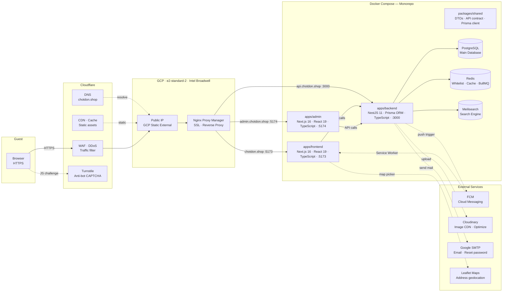

# E-Commerce Monorepo Project

Dự án e-commerce cá nhân tự build để học, kiến trúc monorepo gồm frontend, admin và backend. Phần backend là trọng tâm chính — thử tay với các bài toán như xử lý đơn hàng async, cache, bảo mật token thay vì chỉ làm CRUD đơn giản.

## Sơ đồ tổng quan - Kiến trúc hạ tầng — [chotdon.shop](http://chotdon.shop)



---

## Chi tiết các thành phần hạ tầng

### Cloudflare

Thành phần

Vai trò

**DNS**

Quản lý DNS cho tên miền `chotdon.shop`.

**WAF · DDoS Shield**

Lọc traffic độc hại, chặn DDoS ở tầng ứng dụng.

**CDN · Cache**

Cache static assets (images, JS, CSS) ở edge, giảm tải server gốc.

**Turnstile**

Anti-bot CAPTCHA, nhúng thẳng vào form phía Frontend, không làm phiền user.

### GCP VM (e2-standard-2)

Thành phần

Vai trò / Thông số

**Public IP**

Static external IP của GCP — điểm vào duy nhất của hệ thống.

**Nginx Proxy Manager**

Reverse proxy, tự cấp và gia hạn SSL Let's Encrypt, điều phối subdomain.

**Cấu hình phần cứng**

`e2-standard-2` — 2 vCPUs, 8 GB RAM, Intel Broadwell.

Routing subdomain:

- `chotdon.shop , vi.chotdon.shop , en.chotdon.shop` → Frontend (`:5173`)
- `admin.chotdon.shop` → Admin Dashboard (`:5174`)
- `api.chotdon.shop` → Backend NestJS (`:3000`)

### Docker Compose — Monorepo Services

Thành phần

Stack

Vai trò

**packages/shared**

DTOs, API Contract, Prisma Client

Code dùng chung giữa client và server, tránh lệch kiểu dữ liệu giữa hai đầu.

**apps/frontend**

Next.js 16 · React 19 · TypeScript

App phía người dùng cuối.

**apps/admin**

Next.js 16 · React 19 · TypeScript

Dashboard quản trị cho nhân viên và admin.

**apps/backend**

NestJS 11 · Prisma ORM · TypeScript

API core, xử lý toàn bộ business logic.

**PostgreSQL**

PostgreSQL 16

Database chính.

**Redis**

Redis Stack

Cache, lưu token whitelist, chạy BullMQ queue.

**Meilisearch**

Meilisearch Engine

Full-text search cho sản phẩm.

### External Services

Dịch vụ

Tích hợp

Luồng dữ liệu

**Firebase FCM**

Push notification realtime.

Backend → FCM → Web Service Worker

**Cloudinary**

Lưu trữ và tối ưu ảnh upload.

Backend → Cloudinary API

**Google SMTP**

Gửi mail xác thực, reset password.

Backend → SMTP Server

**Leaflet Maps**

Bản đồ chọn địa chỉ giao hàng.

Frontend → OpenStreetMap API

---

## Luồng Request

```plaintext
Client Browser
 └─► Cloudflare (DNS → WAF/DDoS → CDN)
       └─► GCP Public IP
             └─► Nginx Proxy Manager (SSL terminate)
                   ├─► chotdon.shop       → Next.js Frontend (:5173)
                   │     ├─► Leaflet Maps
                   │     └─► FCM Service Worker (Push alert)
                   ├─► admin.chotdon.shop → Next.js Admin Dashboard (:5174)
                   └─► api.chotdon.shop   → NestJS Backend (:3000)
                         ├─► PostgreSQL (Prisma client)
                         ├─► Redis
                         │     ├─► Token Whitelist (bảo vệ JWT sessions)
                         │     ├─► Category Cache (cache cây danh mục)
                         │     └─► BullMQ Queue (xử lý đơn hàng async)
                         ├─► Meilisearch (full-text search)
                         ├─► FCM Admin SDK (trigger push notification)
                         ├─► Cloudinary SDK (upload ảnh)
                         └─► Google SMTP (transactional mail)


```

---

## Technology Stack

Hạng mục

Công nghệ

**Domain & DNS**

`chotdon.shop` qua Cloudflare.

**CDN & Edge Security**

Cloudflare Edge Cache + WAF + Turnstile CAPTCHA.

**Server**

GCP e2-standard-2 (2 vCPUs, 8 GB RAM, Intel Broadwell).

**Proxy & Routing**

Nginx Proxy Manager (SSL tự động qua Let's Encrypt).

**Frontend**

Next.js 16 (App Router), React 19, TypeScript, Tailwind CSS, Framer Motion.

**Backend**

NestJS 11, Prisma ORM, TypeScript.

**Database**

PostgreSQL 16.

**Cache**

Redis — token whitelist và category tree cache.

**Queue**

Redis BullMQ — xử lý đơn hàng async khi tải cao.

**Search**

Meilisearch — sync từ Postgres, phục vụ full-text search.

**Push Notification**

Firebase Cloud Messaging (FCM).

**Media**

Cloudinary Image API.

**Email**

Nodemailer + Google SMTP.

**Maps**

Leaflet.js + OpenStreetMap.

---

## Một số giải pháp kỹ thuật đáng chú ý

### 1. Token Whitelist trên Redis

Access Token ngắn hạn + Refresh Token dài hạn, cả hai lưu trong HTTP-Only Cookie để tránh XSS. Refresh Token ID được giữ trong whitelist trên Redis — khi cần block tài khoản hoặc logout từ xa thì xóa khỏi whitelist là xong, không cần query Postgres.

### 2. Category Cache trên Redis

Cây danh mục sản phẩm nếu query đệ quy từ Postgres mỗi request thì khá tốn. Giải pháp là cache toàn bộ cây dạng JSON lên Redis. Mỗi khi admin sửa danh mục thì invalidate cache, lần request tiếp theo tự load lại.

### 3. Xử lý đơn hàng async với BullMQ

Flash sale hay traffic đột biến mà ghi thẳng vào DB đồng thời dễ bị DB lock. Flow hiện tại: user đặt hàng → push job vào BullMQ queue → trả về "đang xử lý" ngay lập tức → background worker lấy job ra, dùng distributed lock kiểm tra tồn kho, rồi ghi đơn qua Prisma transaction.

### 4. Full-text Search với Meilisearch

Bỏ `LIKE` query, sync dữ liệu sản phẩm sang Meilisearch. Product listing lấy `id` từ Meilisearch rồi hydrate response bằng Prisma để giữ nguyên contract, favorite state và translation include. Có endpoint reindex thủ công và cron job chạy 03:00 hằng ngày để refresh metric/search document.

---

## Feature Checklist

### 1. Authentication & User Profile

- [x] Đăng ký / đăng nhập bằng Email + Password (hash PBKDF2).
- [x] JWT Access/Refresh Token, quản lý trên NestJS.
- [x] Token Whitelist trên Redis — hỗ trợ revoke token và logout tức thì.
- [x] Auto refresh session khi token hết hạn.
- [x] Logout xóa cookie + revoke token khỏi Redis.
- [x] Forgot password / Reset password qua Google SMTP.
- [x] Cập nhật profile, đổi mật khẩu.
- [x] Upload avatar lên Cloudinary.
- [x] Address book CRUD — thêm/sửa/xóa nhiều địa chỉ giao hàng.
- [x] Chọn địa chỉ qua map picker (Leaflet).

### 2. Homepage & Discovery

- [x] Dynamic sections/banners theo config ngôn ngữ.
- [x] Trang New Arrivals — infinite scroll + virtual grid.
- [x] Brands listing.
- [x] Global search tích hợp Meilisearch.

### 3. Categories & Brands

- [x] Category tree đa cấp.
- [x] Cache cây danh mục trên Redis.
- [x] Brand detail + Top Brands.
- [x] Filter sản phẩm theo danh mục và thương hiệu.

### 4. Products & Catalog

- [x] Bộ lọc nâng cao: danh mục, thương hiệu, rating, khoảng giá.
- [x] Sorting theo giá và ngày mới nhất.
- [x] Search/filter/sort sản phẩm bằng Meilisearch, có fallback Prisma khi search service chưa sẵn sàng.
- [x] Manual reindex endpoint và nightly reindex job cho product search document.
- [x] Product detail — thông số, thuộc tính, chọn SKU variant.
- [x] Fallback SKU tự động khi hết hàng hoặc SKU không hợp lệ.
- [x] Ratings & Reviews (1–5 sao + bình luận).
- [x] Filter review theo rating, phân trang phía client.
- [x] Chỉ cho phép đánh giá nếu đã mua và đã nhận hàng thành công.

### 5. Favorites & Browsing History

- [x] Thêm/xóa wishlist.
- [x] Sync trạng thái yêu thích realtime trên product card.
- [x] Tự động ghi Recently Viewed.
- [x] Xem danh sách sản phẩm đã duyệt gần đây.

### 6. Flash Sales & Coupons

- [x] Danh sách Flash Sale đang chạy + countdown realtime.
- [x] Tồn kho Flash Sale tách biệt theo từng SKU.
- [x] Áp dụng coupon/voucher khi đặt hàng.

### 7. Cart & Checkout

- [x] CRUD giỏ hàng — thêm, cập nhật số lượng, xóa.
- [x] Sync giỏ hàng client-server (Zustand + localStorage, sync với DB khi đăng nhập).
- [x] Kiểm tra giới hạn tồn kho SKU/Flash Sale trước khi checkout.
- [x] Trang checkout — tóm tắt đơn, chọn địa chỉ giao hàng, áp coupon.

### 8. Orders & Returns

- [x] Đặt hàng async qua BullMQ queue.
- [x] Tạo đơn bằng Prisma transaction — đảm bảo tồn kho không bị race condition.
- [x] Tự dọn cart sau khi đặt hàng thành công.
- [x] Lịch sử đơn hàng + timeline trạng thái.
- [x] Hủy đơn khi còn ở trạng thái Pending + hoàn tồn kho.
- [x] Gửi yêu cầu trả hàng/hoàn tiền kèm ảnh và lý do.

### 9. Notifications

- [x] Đăng ký FCM token để nhận push notification.
- [x] Service Worker nhận và hiển thị push khi tab đang chạy nền.
- [x] In-app notification center — cập nhật trạng thái đơn hàng.
- [x] Badge đếm thông báo chưa đọc, tự sync khi tab được focus lại.

### 10. Help Center & Static Pages

- [x] Help Center — FAQ, chính sách vận chuyển.
- [x] Contact form gửi về backend.
- [x] Terms of Service, Privacy Policy.
- [x] Proxy routing URL theo ngôn ngữ subdomain.

### 11. Admin Console

- [x] RBAC — phân quyền theo vai trò ở Backend.
- [x] Danh sách đơn hàng toàn hệ thống, phân trang + filter.
- [x] Cập nhật trạng thái đơn hàng.
- [x] API duyệt/từ chối yêu cầu trả hàng/hoàn tiền.
- [x] CRUD danh mục sản phẩm (cây phân cấp) — Backend.
- [x] CRUD user, vai trò và quyền — Backend.
- [x] Admin orders page — Frontend.
- [x] Admin product detail edit — Frontend.
- [x] Common admin table foundation: resize, sort hook, page size, index column, loading/error.
- [ ] Admin Dashboard Shell & Navigation — Frontend.
- [ ] Đồng bộ metadata và favicon từ app Frontend sang Admin.
- [ ] Product create/list/status/deactivate management — Frontend.
- [ ] Dedicated inventory/stock adjustment UI — Frontend.
- [ ] Category Management UI.
- [ ] Brand Management UI.
- [ ] Return Management UI.
- [ ] Customer Management UI.
- [ ] RBAC Management UI.
- [ ] Analytics Dashboard — doanh thu, báo cáo.
- [ ] Promotion/Coupon Management UI.
- [ ] Xem danh sách ticket hỗ trợ từ khách hàng.

### 12. Roadmap

- [ ] Tích hợp cổng thanh toán: VNPAY, MoMo, Stripe.
- [ ] Logging/Monitoring tập trung: Sentry, Prometheus, Grafana.
- [ ] CI/CD pipeline.

---

## Deploy

```bash
# Copy và điền .env ở root monorepo
docker compose --env-file .env.backend up -d --build


```
