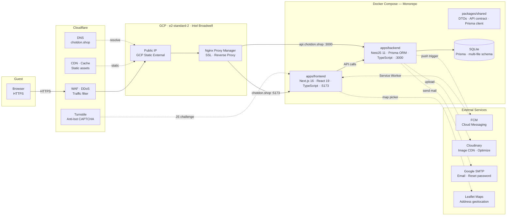

# E-Commerce Monorepo Project

Dự án e-commerce xây dựng theo mô hình monorepo chia sẻ contract dữ liệu chặt chẽ giữa frontend và backend thông qua package shared. Dự án tập trung vào luồng mua hàng tối ưu, hiệu năng cao, tích hợp các giải pháp bảo mật và chuẩn tiếp cận quốc tế.

# Kiến trúc hạ tầng — chotdon.shop

## Sơ đồ tổng quan



---

## Chi tiết các thành phần

### Cloudflare

| Thành phần            | Vai trò                                     |
| --------------------- | ------------------------------------------- |
| **DNS**               | DNS Resolver `chotdon.shop`                 |
| **WAF · DDoS Shield** | Lọc traffic độc hại, chống tấn công DDoS    |
| **CDN · Cache**       | Cache static assets, giảm tải origin server |
| **Turnstile**         | Xác thực chống bot/spam nhúng vào frontend  |

### GCP · VPC

| Thành phần              | Vai trò / Thông số kỹ thuật                            |
| ----------------------- | ------------------------------------------------------ |
| **Public IP**           | GCP Static External IP — điểm vào duy nhất của hạ tầng |
| **Nginx Proxy Manager** | Reverse proxy, terminate SSL/TLS, định tuyến subdomain |
| **Cấu hình VM**         | Machine type: `e2-standard-2` (2 vCPUs, 8 GB Memory)   |

Subdomain routing:

- `chotdon.shop` → Frontend `:5173`
- `api.chotdon.shop` → Backend `:3000`

### Docker Compose — Monorepo

| Thành phần          | Stack                                        | Port    |
| ------------------- | -------------------------------------------- | ------- |
| **packages/shared** | DTOs, API contract, Prisma client dùng chung | —       |
| **apps/frontend**   | Next.js 16 · React 19 · TypeScript           | `:5173` |
| **apps/backend**    | NestJS 11 · Prisma ORM · TypeScript          | `:3000` |
| **SQLite**          | Prisma ORM                                   | —       |

### External Services

| Service          | Tích hợp                                                | Phía    |
| ---------------- | ------------------------------------------------------- | ------- |
| **Firebase FCM** | Backend trigger → Service Worker nhận push notification | BE → FE |
| **Cloudinary**   | Upload & optimize ảnh qua SDK                           | BE      |
| **Google SMTP**  | Gửi email quên mật khẩu, reset password                 | BE      |
| **Leaflet Maps** | Map Picker chọn địa chỉ giao hàng                       | FE      |

---

## Luồng request

```
Browser
 └─► Cloudflare (DNS → WAF/DDoS → CDN)
       └─► GCP Public IP
             └─► Nginx Proxy Manager (SSL terminate)
                   ├─► chotdon.shop       → Next.js :5173
                   │     ├─► Leaflet Maps
                   │     └─► FCM Service Worker (push notification)
                   └─► api.chotdon.shop   → NestJS :3000
                         ├─► SQLite (Prisma ORM)
                         ├─► FCM (push trigger)
                         ├─► Cloudinary (image upload)
                         └─► Google SMTP (email)
```

---

## Stack tóm tắt

| Hạng mục             | Công nghệ                                                         |
| -------------------- | ----------------------------------------------------------------- |
| Domain               | `chotdon.shop`                                                    |
| DNS · CDN · Security | Cloudflare + Turnstile                                            |
| Hosting              | GCP e2-standard-2 (2 vCPUs, 8 GB Memory, Intel Broadwell, x86/64) |
| Reverse Proxy        | Nginx Proxy Manager                                               |
| Frontend             | Next.js 16, React 19, TypeScript                                  |
| Backend              | NestJS 11, Prisma ORM, TypeScript                                 |
| Database             | SQLite (multi-file Prisma schema)                                 |
| Orchestration        | Docker Compose (Monorepo)                                         |
| Auth                 | JWT nội bộ (Access/Refresh Token)                                 |
| Push Notification    | Firebase Cloud Messaging (FCM)                                    |
| Image                | Cloudinary                                                        |
| Email                | Google SMTP                                                       |
| Map                  | Leaflet.js                                                        |

## Tích hợp & Tiêu chuẩn kỹ thuật

### Tiêu chuẩn tiếp cận (WAI-ARIA)

Sử dụng React Aria Components. Giao diện đáp ứng chuẩn tiếp cận WCAG 2.1, hỗ trợ điều hướng phím và thiết bị đọc màn hình (nhãn aria-label, aria-labelledby đầy đủ).

### Đa ngôn ngữ (i18n) & Phân tách định tuyến

Quản lý ngôn ngữ (en/vi) qua next-intl. Sử dụng proxy định tuyến nội bộ để ánh xạ các URL tĩnh/động theo ngôn ngữ (ví dụ /privacy thành /[locale]/privacy dựa trên ngôn ngữ subdomain hoặc request client).

### Lưu trữ & API tích hợp

- Cloudinary: Upload và tối ưu hóa hình ảnh qua Cloudinary SDK ở backend.
- Firebase Admin SDK: Gửi thông báo đẩy thời gian thực qua FCM.

## Chi tiết các luồng tính năng cốt lõi

### 1. Xác thực & Phân quyền (RBAC)

- Xác thực: Dùng tài khoản email/mật khẩu (băm PBKDF2), quản lý phiên qua JWT (Access/Refresh Token) lưu trong HTTP-only Cookie.
- Phân quyền: Kiểm soát bằng Roles & Permissions qua Guards ở backend. Admin CRUD role, gán permission và gán role cho tài khoản.

### 2. Giỏ hàng, Khuyến mãi & Thanh toán

- Đặt hàng: Xử lý qua Prisma Transactions (kiểm tra tồn kho SKU, trừ kho, áp coupon, dọn giỏ hàng).
- Ràng buộc tồn kho: Client kiểm tra tồn kho real-time từ SKU Flash Sale hoặc kho thường để giới hạn số lượng thêm vào giỏ.

### 3. Flash Sales & Tồn kho khuyến mãi

- Countdown thời gian thực ở frontend.
- Tồn kho Flash Sale được tách biệt và tự động hoàn lại nếu đơn hàng bị hủy trước khi thanh toán.

### 4. Đơn hàng, Trả hàng & Đánh giá

- Lịch sử đơn hàng: Hiển thị timeline trạng thái đơn (Pending, Processing, Shipped, Delivered, Cancelled).
- Trả hàng: Khách gửi yêu cầu kèm lý do và ảnh minh chứng. Admin duyệt/hủy yêu cầu.
- Đánh giá: Chỉ cho phép đánh giá những sản phẩm đã giao thành công cho chính user đó.

### 5. Hệ thống thông báo đẩy (FCM Push Notifications)

- FCM Push Alerts: Tích hợp Service Worker ở frontend để nhận thông báo thời gian thực khi trình duyệt chạy ngầm.
- Notification Center: Đồng bộ tin nhắn chưa đọc real-time, tự động deduplicate request khi focus trình duyệt.

### 6. Admin Console

- Cập nhật trạng thái đơn hàng.
- CRUD danh mục theo dạng cây phân cấp (Category Tree).
- Xem phản hồi (Contact Submissions), quản lý tài khoản và gán vai trò.

## Danh sách tính năng (Feature Checklist)

### 1. Xác thực & Người dùng (Authentication & User Profile)

- [x] Đăng ký tài khoản (Sign Up) & Đăng nhập (Sign In) bằng Email/Password (mật khẩu băm PBKDF2).
- [x] Cấp phát & quản lý Local JWT (Access/Refresh Token) trên NestJS backend.
- [x] Tự động gia hạn phiên đăng nhập (Refresh Token queue) tại request client.
- [x] Đăng xuất (Logout) xóa cookie và thu hồi token.
- [x] Luồng quên mật khẩu (Forgot Password) & Đặt lại mật khẩu (Reset Password) qua Google SMTP.
- [x] Cập nhật thông tin cá nhân (Profile Update) & Thay đổi mật khẩu (Change Password).
- [x] Tải lên và cập nhật ảnh đại diện (Avatar Cloudinary Upload).
- [x] Sổ địa chỉ (Address book CRUD): Thêm, sửa, xóa nhiều địa chỉ giao hàng.
- [x] Định vị địa điểm địa chỉ qua bản đồ tương tác (Map Picker Modal/Leaflet).

### 2. Trang chủ & Khám phá (Homepage & Discovery)

- [x] Hiển thị các section động (Dynamic sections/banners) theo cấu hình ngôn ngữ.
- [x] Trang sản phẩm mới (New Arrivals) hỗ trợ cuộn vô hạn (Infinite Scrolling) và virtual grid layout.
- [x] Trang thương hiệu (Brands listing) hiển thị danh sách các thương hiệu nổi bật.
- [x] Tính năng Tìm kiếm toàn cầu (Global Search) tích hợp lọc kết quả.

### 3. Danh mục & Thương hiệu (Categories & Brands)

- [x] Hiển thị cây danh mục sản phẩm (Category Tree) đa cấp.
- [x] Xem sản phẩm theo thương hiệu (Brand details) & Danh sách thương hiệu hàng đầu (Top Brands).
- [x] Lọc sản phẩm theo danh mục và thương hiệu tương ứng.

### 4. Sản phẩm & Chi tiết (Products & Catalog)

- [x] Danh sách sản phẩm hỗ trợ bộ lọc nâng cao (Danh mục, Thương hiệu, Rating, Khoảng giá).
- [x] Sắp xếp sản phẩm (Sorting) theo giá tăng/giảm, hàng mới nhất.
- [x] Trang chi tiết sản phẩm hiển thị thông số, thuộc tính và chọn biến thể SKU.
- [x] Tự động tối ưu fallback SKU khi hết hàng hoặc thông tin SKU không hợp lệ.
- [x] Gửi đánh giá sản phẩm (Ratings & Reviews): Điểm số (1-5 sao), bình luận.
- [x] Lọc đánh giá theo ratings, phân trang đánh giá tại Client.
- [x] Kiểm tra điều kiện đánh giá (chỉ người mua sản phẩm đã nhận hàng thành công mới được đánh giá).

### 5. Yêu thích & Sản phẩm đã xem (Favorites & Browsing History)

- [x] Thêm/Xóa sản phẩm khỏi danh sách yêu thích (Wishlist).
- [x] Đồng bộ yêu thích thời gian thực, hiển thị trạng thái yêu thích trên thẻ sản phẩm.
- [x] Tự động ghi nhận lịch sử duyệt sản phẩm (Recently Viewed).
- [x] Xem danh sách các sản phẩm đã xem gần đây.

### 6. Flash Sale & Khuyến mãi (Flash Sales & Coupons)

- [x] Hiển thị danh sách Flash Sale đang diễn ra kèm đồng hồ countdown thời gian thực.
- [x] Áp dụng tồn kho Flash Sale riêng biệt cho từng SKU.
- [x] Áp dụng mã giảm giá (Coupons/Vouchers) khi đặt hàng.

### 7. Giỏ hàng & Thanh toán (Cart & Checkout)

- [x] CRUD sản phẩm trong giỏ hàng (thêm sản phẩm, cập nhật số lượng, xóa sản phẩm).
- [x] Đồng bộ giỏ hàng client-server (Zustand + local storage đồng bộ với DB khi đăng nhập).
- [x] Kiểm tra giới hạn số lượng tồn kho SKU/Flash Sale tại client trước khi thanh toán.
- [x] Trang checkout hiển thị tóm tắt đơn hàng, chọn địa chỉ giao hàng mặc định hoặc chọn từ danh sách.
- [x] Hỗ trợ áp dụng mã giảm giá tại trang checkout.

### 8. Đơn hàng & Trả hàng (Orders & Returns)

- [x] Tạo đơn hàng thông qua Prisma Transactions bảo vệ tồn kho (tránh race-condition).
- [x] Dọn dẹp giỏ hàng đối với các sản phẩm đã thanh toán thành công.
- [x] Xem lịch sử đơn hàng & chi tiết đơn hàng (timeline trạng thái đơn hàng).
- [x] Hủy đơn hàng (Cancel Order) khi đơn hàng ở trạng thái chờ xử lý (Pending).
- [x] Khôi phục tồn kho sản phẩm khi hủy đơn hàng.
- [x] Gửi yêu cầu Trả hàng/Hoàn tiền (Order Returns) đính kèm hình ảnh và lý do.

### 9. Thông báo (Notifications)

- [x] Đăng ký nhận thông báo đẩy (FCM Token Register).
- [x] Service Worker nhận và hiển thị thông báo đẩy khi trình duyệt chạy ngầm (FCM Push Alerts).
- [x] In-app Notification Center hiển thị các thông báo thay đổi trạng thái đơn hàng.
- [x] Đếm số lượng thông báo chưa đọc, tự động đồng bộ khi focus trình duyệt.

### 10. Trợ giúp & Trang tĩnh (Help Center & Static Pages)

- [x] Trang hỗ trợ (Help Center) hiển thị danh mục bài viết FAQ, chính sách vận chuyển.
- [x] Biểu mẫu liên hệ hỗ trợ (Contact Form submissions) gửi tới backend.
- [x] Các trang điều khoản (Terms of Service) và chính sách bảo mật (Privacy Policy).
- [x] Proxy định tuyến URL động theo ngôn ngữ subdomain.

### 11. Quản trị hệ thống (Admin Console)

- [x] Hệ thống phân quyền dựa trên vai trò (RBAC - Roles & Permissions) ở Backend.
- [x] Xem danh sách đơn hàng toàn hệ thống kèm phân trang và bộ lọc (Frontend + Backend).
- [x] Cập nhật trạng thái đơn hàng (Frontend + Backend).
- [x] Tiếp nhận, duyệt/hủy các yêu cầu Trả hàng/Hoàn tiền (Frontend + Backend).
- [x] CRUD danh mục sản phẩm theo cấu trúc cây (Backend).
- [x] CRUD tài khoản người dùng, vai trò & quyền hạn (Backend).
- [ ] Giao diện Quản trị viên (Admin Dashboard Shell & Navigation) ở Frontend.
- [ ] Giao diện quản lý Sản phẩm, SKU & Quản trị tồn kho ở Frontend.
- [ ] Giao diện quản lý Danh mục sản phẩm (Category Management UI) ở Frontend.
- [ ] Giao diện quản lý Thương hiệu (Brand Management UI) ở Frontend.
- [ ] Giao diện quản lý Người dùng & Phân quyền (RBAC Management UI) ở Frontend.
- [ ] Bảng thống kê doanh thu và báo cáo phân tích (Analytics Dashboard).
- [ ] Giao diện quản lý Khuyến mãi/Mã giảm giá (Promotion/Coupon UI).
- [ ] Xem danh sách thư liên hệ hỗ trợ từ khách hàng (Help submissions UI).

### 12. Tính năng nâng cao (Post-MVP Roadmap)

- [ ] Tích hợp cổng thanh toán trực tuyến (VNPAY, MoMo, Stripe).
- [ ] Hệ thống Caching bằng Redis (Homepage, Product details).
- [ ] Tích hợp công cụ tìm kiếm nâng cao (Elasticsearch / Meilisearch).
- [ ] Hệ thống Logging/Monitoring tập trung (Sentry, Prometheus, Grafana).
- [ ] Tự động hóa quy trình CI/CD.

## Triển khai Docker (Production)

1. Thiết lập tệp cấu hình `.env` ở thư mục gốc của monorepo.
2. Build và khởi chạy các container:
   ```bash
   docker-compose up -d --build
   ```
